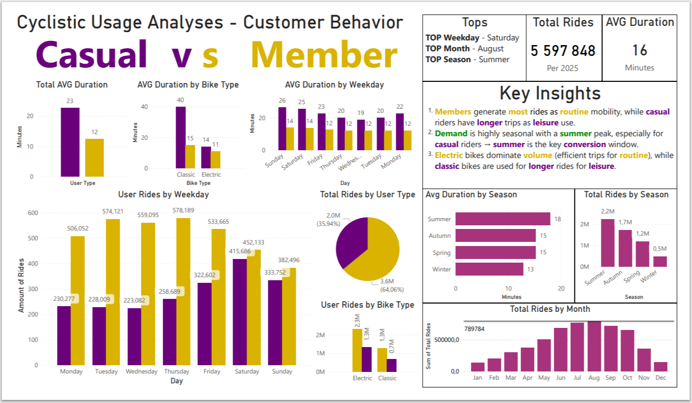

# Cyclistic Bike-Share Analysis

## 📌 Business Problem
Cyclistic aims to increase the number of annual members, as they are more profitable than casual riders.  
The objective of this analysis is to identify behavioral differences between casual riders and members to support conversion strategies.

---

## 📊 Data
- Source: Divvy public dataset
- Period: 12 months
- Size: ~5.6 million records
- Location: Chicago bike-share system

---

## 🛠 Tools Used
- PostgreSQL — data cleaning & analysis  
- Excel — preprocessing  
- Power BI — visualization  

---

## ⚙️ Process
1. Data cleaning (duplicates, invalid trips)
2. Feature engineering (ride_length, day_of_week)
3. SQL analysis (user behavior, seasonality, bike type)
4. Dashboard creation (Excel + Power BI)

---

## 🔍 Key Insights

- Members generate the majority of rides → routine usage  
- Casual riders have significantly longer trips → leisure behavior  
- Strong seasonality → summer is peak demand  
- Electric bikes dominate short and efficient trips  
- Casual riders are weekend-oriented, while members are weekday-oriented  

---

## 💡 Recommendations

1. Launch seasonal campaigns focused on summer  
2. Position membership as a leisure product, not only commuting  
3. Use electric bikes as an entry point for conversion  

---

## 📊 Dashboard

---

## 📁 Project Structure

- `/docs` — full case study  
- `/sql` — SQL analysis  
- `/process` — data cleaning steps  
- `/dashboard` — Power BI visualization  
- `/CSV` — Excel supporting dataset for viz

---

## 🚀 Conclusion

Casual riders demonstrate high engagement during peak periods (especially summer), making them the most promising segment for conversion into annual members.
